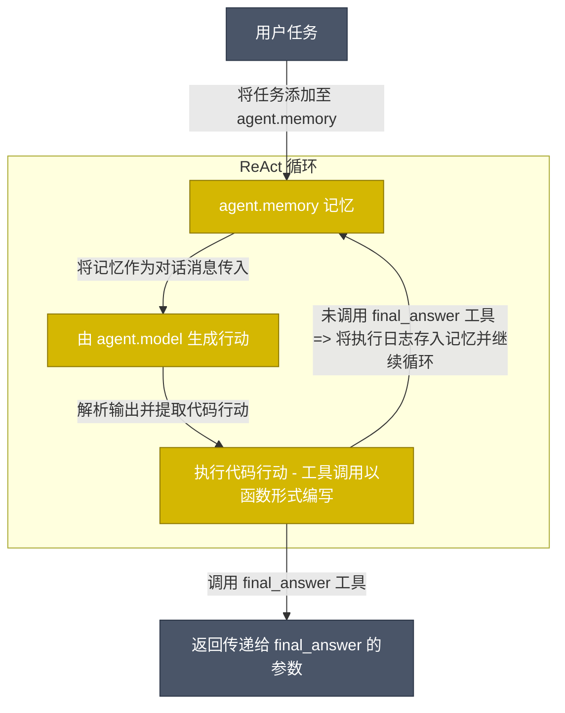

<!---
Copyright 2024 The HuggingFace Team. All rights reserved.

Licensed under the Apache License, Version 2.0 (the "License");
you may not use this file except in compliance with the License.
You may obtain a copy of the License at

    http://www.apache.org/licenses/LICENSE-2.0

Unless required by applicable law or agreed to in writing, software
distributed under the License is distributed on an "AS IS" BASIS,
WITHOUT WARRANTIES OR CONDITIONS OF ANY KIND, either express or implied.
See the License for the specific language governing permissions and
limitations under the License.
-->
<p align="center">
    <!-- Uncomment when CircleCI is set up
    <a href="https://circleci.com/gh/huggingface/accelerate"></a>
    -->
    <a href="https://github.com/huggingface/smolagents/blob/main/LICENSE"></a>
    <a href="https://huggingface.co/docs/smolagents"></a>
    <a href="https://github.com/huggingface/smolagents/releases"></a>
    <a href="https://github.com/huggingface/smolagents/blob/main/CODE_OF_CONDUCT.md"></a>
    <a href="https://deepwiki.com/huggingface/smolagents"></a>
</p>

<p align="center">
    <a href="README.md">English</a> · <b>中文</b>
</p>

<h3 align="center">
  <div style="display:flex;flex-direction:row;">
    
    <p>直接用代码思考的智能体！</p>
  </div>
</h3>

`smolagents` 是一个让你仅需数行代码即可运行强大智能体（Agents）的精简库。它具备以下特性：

✨ **极简设计（Simplicity）**：智能体的核心逻辑仅约 1,000 行代码（详见 [agents.py](https://github.com/huggingface/smolagents/blob/main/src/smolagents/agents.py)）。我们将抽象层保持在原生代码之上的最小形态！

🧑‍💻 **一流的代码智能体（Code Agents）支持**：我们的 [`CodeAgent`](https://huggingface.co/docs/smolagents/reference/agents#smolagents.CodeAgent) 将其行动直接编写为代码执行（而非单纯“让智能体去编写代码”）。为确保安全性，我们支持通过 [Blaxel](https://blaxel.ai)、[E2B](https://e2b.dev/)、[Modal](https://modal.com/) 或 Docker 在沙箱环境中隔离运行。

🤗 **Hub 深度集成**：你可以直接从 Hugging Face Hub [共享或拉取工具与智能体](https://huggingface.co/docs/smolagents/reference/tools#smolagents.Tool.from_hub)，实现高效智能体的即时共享！

🌐 **模型无感知（Model-agnostic）**：smolagents 支持任何 LLM。它可以是本地的 `transformers` 或 `ollama` 模型、[Hub 上的众多推理提供商](https://huggingface.co/blog/inference-providers) 之一，或通过 [LiteLLM](https://www.litellm.ai/) 接入来自 OpenAI、Anthropic 等众多供应商的模型。

👁️ **多模态支持（Modality-agnostic）**：智能体原生支持文本、视觉、视频乃至音频输入！视觉示例可参考[此教程](https://huggingface.co/docs/smolagents/examples/web_browser)。

🛠️ **工具生态兼容（Tool-agnostic）**：你可以使用来自任何 [MCP 服务器](https://huggingface.co/docs/smolagents/reference/tools#smolagents.ToolCollection.from_mcp)、[LangChain](https://huggingface.co/docs/smolagents/reference/tools#smolagents.Tool.from_langchain) 的工具，甚至可以直接将 [Hub Space](https://huggingface.co/docs/smolagents/reference/tools#smolagents.Tool.from_space) 作为工具调用。

完整文档请参阅[官方文档页面](https://huggingface.co/docs/smolagents/index)。

> [!NOTE]
> 查看我们的[发布博客](https://huggingface.co/blog/smolagents)了解更多关于 `smolagents` 的设计理念！

## 快速演示

首先安装带有默认工具包的库：
```bash
pip install "smolagents[toolkit]"
```

接着定义你的智能体，为其装配所需工具并运行：
```py
from smolagents import CodeAgent, WebSearchTool, InferenceClientModel

model = InferenceClientModel()
agent = CodeAgent(tools=[WebSearchTool()], model=model, stream_outputs=True)

agent.run("一只全速奔跑的花豹穿过巴黎艺术桥需要多少秒？")
```

https://github.com/user-attachments/assets/84b149b4-246c-40c9-a48d-ba013b08e600

你甚至可以将智能体作为一个 Space 仓库直接推送到 Hub：
```py
agent.push_to_hub("m-ric/my_agent")

# 通过 agent.from_hub("m-ric/my_agent") 即可从 Hub 加载该智能体
```

我们的库对底层 LLM 完全解耦：你可以轻松将上述示例切换至任何推理提供商。

<details>
<summary> <b>InferenceClientModel，连接 HF 支持的所有<a href="https://huggingface.co/docs/inference-providers/index">推理提供商</a>的网关</b></summary>

```py
from smolagents import InferenceClientModel

model = InferenceClientModel(
    model_id="deepseek-ai/DeepSeek-R1",
    provider="together",
)
```
</details>
<details>
<summary> <b>LiteLLM，畅享 100+ 种主流大语言模型</b></summary>

```py
import os
from smolagents import LiteLLMModel

model = LiteLLMModel(
    model_id="anthropic/claude-4-sonnet-latest",
    temperature=0.2,
    api_key=os.environ["ANTHROPIC_API_KEY"]
)
```
</details>
<details>
<summary> <b>OpenAI 兼容服务端：Together AI</b></summary>

```py
import os
from smolagents import OpenAIModel

model = OpenAIModel(
    model_id="deepseek-ai/DeepSeek-R1",
    api_base="https://api.together.xyz/v1/", # 留空则默认请求 OpenAI 官方服务器。
    api_key=os.environ["TOGETHER_API_KEY"], # 切换至对应服务端的 API 密钥。
)
```
</details>
<details>
<summary> <b>OpenAI 兼容服务端：OpenRouter</b></summary>

```py
import os
from smolagents import OpenAIModel

model = OpenAIModel(
    model_id="openai/gpt-4o",
    api_base="https://openrouter.ai/api/v1", # 留空则默认请求 OpenAI 官方服务器。
    api_key=os.environ["OPENROUTER_API_KEY"], # 切换至对应服务端的 API 密钥。
)
```

</details>
<details>
<summary> <b>本地 `transformers` 模型</b></summary>

```py
from smolagents import TransformersModel

model = TransformersModel(
    model_id="Qwen/Qwen3-Next-80B-A3B-Thinking",
    max_new_tokens=4096,
    device_map="auto"
)
```
</details>
<details>
<summary> <b>Azure 托管模型</b></summary>

```py
import os
from smolagents import AzureOpenAIModel

model = AzureOpenAIModel(
    model_id = os.environ.get("AZURE_OPENAI_MODEL"),
    azure_endpoint=os.environ.get("AZURE_OPENAI_ENDPOINT"),
    api_key=os.environ.get("AZURE_OPENAI_API_KEY"),
    api_version=os.environ.get("OPENAI_API_VERSION")    
)
```
</details>
<details>
<summary> <b>Amazon Bedrock 托管模型</b></summary>

```py
import os
from smolagents import AmazonBedrockModel

model = AmazonBedrockModel(
    model_id = os.environ.get("AMAZON_BEDROCK_MODEL_ID") 
)
```
</details>

## 命令行工具 (CLI)

你可以通过两个 CLI 命令直接运行智能体：`smolagent` 与 `webagent`。

`smolagent` 是一个通用命令，用于运行可配备各种工具的多步 `CodeAgent`。

```bash
# 直接传入提示词与选项运行
smolagent "Plan a trip to Tokyo, Kyoto and Osaka between Mar 28 and Apr 7."  --model-type "InferenceClientModel" --model-id "Qwen/Qwen3-Next-80B-A3B-Thinking" --imports pandas numpy --tools web_search

# 交互模式运行（未提供提示词时将启动交互式配置向导）
smolagent
```

交互模式将引导你完成：
- 智能体类型选择（CodeAgent 与 ToolCallingAgent）  
- 从可用工具箱中挑选工具
- 模型配置（类型、ID、API 设置）
- 高级选项（如额外的 Python 库导入）
- 任务提示词输入

同时，`webagent` 是一个基于 [helium](https://github.com/mherrmann/helium) 的专用网页浏览智能体（详情见[此处源码](https://github.com/huggingface/smolagents/blob/main/src/smolagents/vision_web_browser.py)）。

例如：
```bash
webagent "go to xyz.com/men, get to sale section, click the first clothing item you see. Get the product details, and the price, return them. note that I'm shopping from France" --model-type "LiteLLMModel" --model-id "gpt-5"
```

## 代码智能体（Code Agents）是如何工作的？

我们的 [`CodeAgent`](https://huggingface.co/docs/smolagents/reference/agents#smolagents.CodeAgent) 大体上与经典 ReAct 智能体类似 —— 唯一的区别在于 LLM 引擎将其行动直接编写为 Python 代码片段。



行动现已成为 Python 代码片段，因此工具调用直接体现为 Python 函数调用。例如，智能体可以在单次行动中对多个网站发起搜索：
```py
requests_to_search = ["gulf of mexico america", "greenland denmark", "tariffs"]
for request in requests_to_search:
    print(f"Here are the search results for {request}:", web_search(request))
```

将行动编写为代码片段已被证明优于目前业界让 LLM 输出待调用工具字典的做法：[减少 30% 的推理步骤](https://huggingface.co/papers/2402.01030)（从而减少 30% 的 LLM API 调用），并且[在复杂基准测试中获得更高表现](https://huggingface.co/papers/2411.01747)。更多深入讲解请参阅[智能体高阶入门指南](https://huggingface.co/docs/smolagents/conceptual_guides/intro_agents)。

由于代码执行可能存在重大安全隐患（任意代码执行！），**建议在沙箱环境中运行智能体代码**。我们支持多种方案：
  - [E2B](https://e2b.dev/)、[Blaxel](https://blaxel.ai)、[Modal](https://modal.com/) — 托管云沙箱，配置最简单
  - [Docker](https://www.docker.com/) — 自托管容器隔离

内置的 `LocalPythonExecutor` **不是安全沙箱**。它仅施加了部分限制但可被绕过，切勿将其作为安全隔离边界。

除 [`CodeAgent`](https://huggingface.co/docs/smolagents/reference/agents#smolagents.CodeAgent) 外，我们还提供标准的 [`ToolCallingAgent`](https://huggingface.co/docs/smolagents/reference/agents#smolagents.ToolCallingAgent)，它将行动输出为 JSON/文本块。你可以根据业务场景自由选用。

## 这个库究竟有多小（smol）？

我们力求将抽象控制在最精简程度：`agents.py` 中的主体代码不足 1,000 行。
尽管小巧，我们依然实现了多种智能体形态：`CodeAgent` 以 Python 代码片段编写行动，更经典的 `ToolCallingAgent` 则利用原生工具调用方式。我们还支持多智能体层级架构、从工具集导入、远程代码执行、视觉模型支持等丰富特性。

顺便说一句，为什么需要这样一个框架？因为这些底层实现往往并不简单。例如，代码智能体必须在系统提示词、解析器与执行器之间全程保持统一的代码格式，我们的框架为您妥善处理了这些繁琐细节。当然，我们依然鼓励您自由探索源码，并按需提取使用特定模块！

## 开源模型在智能体工作流中的表现如何？

我们使用部分领先模型构建了 [`CodeAgent`](https://huggingface.co/docs/smolagents/reference/agents#smolagents.CodeAgent) 实例，并在 [该基准测试集](https://huggingface.co/datasets/m-ric/agents_medium_benchmark_2)（整合了多个不同维度的综合挑战题集）上进行了对比评估。

关于所使用的智能体设置细节及代码智能体对比常规模式的评测结果，请参考[基准测试源码](https://github.com/huggingface/smolagents/blob/main/examples/smolagents_benchmark/run.py)（剧透：代码智能体表现显著更优）。

<p align="center">
    
</p>

这一评测表明，顶级开源模型现已具备与顶尖闭源模型正面抗衡的强劲实力！

## 安全性声明

在运行代码执行类智能体时，安全性至关重要。请确保使用隔离不受信任代码的沙箱执行选项。

**警告：** `LocalPythonExecutor` 仅提供尽力而为的缓解措施，**并非安全隔离边界**。切勿使用它运行不受信任的代码。

有关安全策略、漏洞报告及安全智能体执行的更多信息，请查阅我们的[安全策略 (Security Policy)](SECURITY.md)。

## 参与贡献

欢迎社区贡献！请查阅我们的[贡献指南 (CONTRIBUTING.md)](https://github.com/huggingface/smolagents/blob/main/CONTRIBUTING.md) 了解如何开始。

## 引用 smolagents

如果您在学术研究或发表物中使用了 `smolagents`，请使用以下 BibTeX 条目进行引用：

```bibtex
@Misc{smolagents,
  title =        {`smolagents`: a smol library to build great agentic systems.},
  author =       {Aymeric Roucher and Albert Villanova del Moral and Thomas Wolf and Leandro von Werra and Erik Kaunismäki},
  howpublished = {\url{https://github.com/huggingface/smolagents}},
  year =         {2025}
}
```
---

> 💡 **文档维护说明**：本中文文档由社区志愿者（@JasonYeYuhe）翻译维护，最后同步更新于 2026年8月31日。如发现内容与官方英文原版存在差异或新特性滞后，欢迎提交 PR 共同完善！
